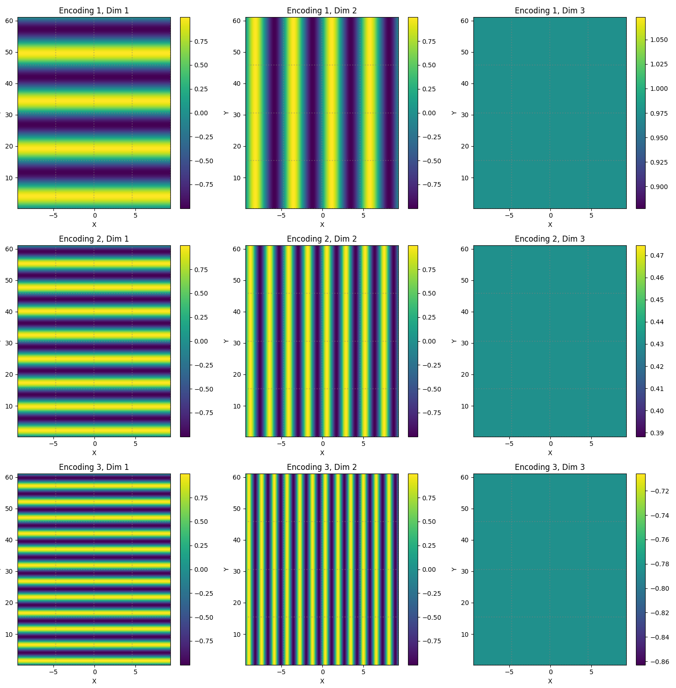
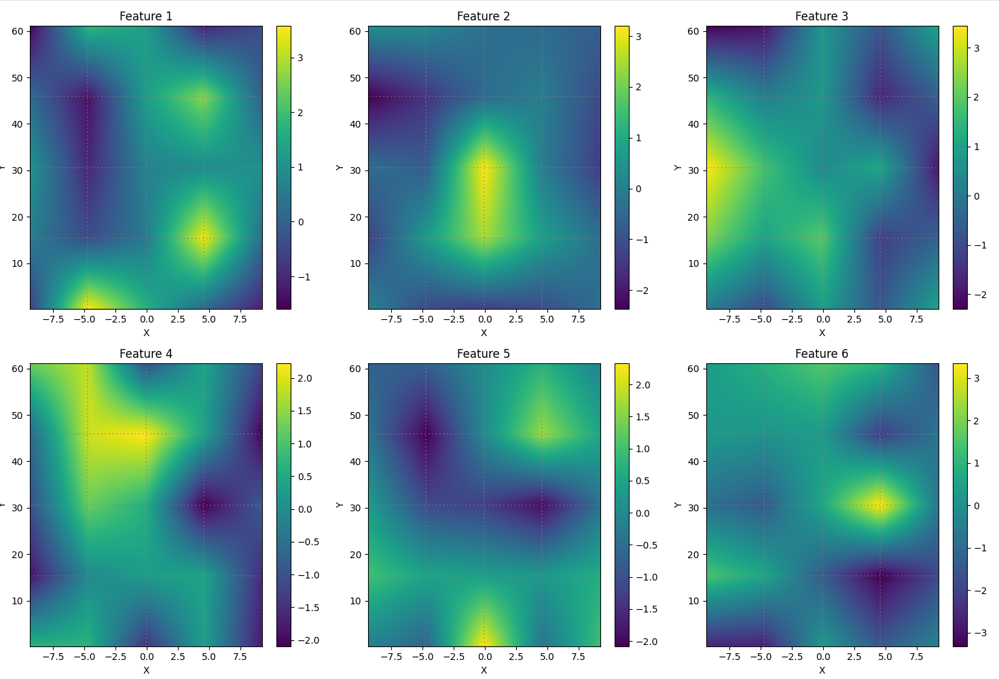
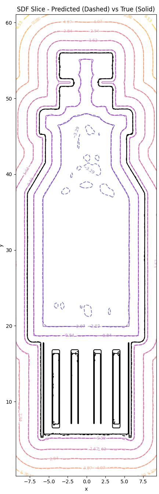

# Neural SDF: Neural Implicit Signed Distance Fields (Work in Progress)

> ⚠️ **Note**: This project is currently under active development.

A JAX-based implementation for approximating the signed distance field of 3D geometries using a neural implicit representation

## Overview

This project provides tools to approximate the signed distance field of closed triangle meshes using neural networks. The core features include:

- Data:
  - Generates signed distance field data from arbitrary closed triangle meshes
  - Makes use of importance sampling (denser sampling around the surface)
- Model:
  - Introduces a new architecture which makes use of a 3D feature grid and positional encoding
    - Anecdotally, this seems to capture fine details better, but rigorous testing needs to be done
  - The code is flexible and allows for easy experimentation with different architectures
- Training:
  - Provides functionality to train and evaluate a model

## Installation

Clone the repository:
```
git clone https://git.autodesk.com/bakara/neural_implicit_contact.git && cd neural_implicit_contact
```

Setup the environment:
```
conda env create -f environment.yml
conda activate nsdf
```

## Usage

### Training a Model

The main training script can be run from the root directory with:
```
python ./neural_sdf/main.py --config ./neural_sdf/configs/default.yaml
```

Config file:
- You can specify a custom config file by replacing `./neural_sdf/configs/default.yaml` with the path to your config file

Optional arguments:
- `--model_name`: Name for the model (default: derived from config filename)
- `--output_dir`: Directory for outputs (default: neural_implicit_contact/experiment_outputs)

### Configuration

The training is controlled by a YAML config file. If not provided, default values will be used. Here's an example config:

```yaml
data:
  mesh_file: usb_male.obj  # Path to input mesh
  scale_factor: 1000       # Scale factor for the mesh
  sampler_ratio: 0.3       # Ratio of samples near surface vs uniform
  train_samples: 10000000  # Number of training samples
  train_batch_size: 100000 # Training batch size
  test_samples: 100000     # Number of test samples
  
model:
  num_grid_points: [5, 5, 5]  # Resolution of feature grid
  feature_size: 10            # Size of feature vectors
  width_size: 100            # Width of MLP layers
  activation_fn: swish       # Activation function (swish or relu)

train:
  learning_rate: 1e-3
  num_epochs: 4000
  save_interval: 100    # Save model every N epochs
  plot_interval: 200    # Generate plots every N epochs
```

See `neural_implicit_contact/configs/default.yaml` for all available options.

## GridNet3D

### Architecture

The GridNet3D architecture is a novel approach used to capture the fine geometric details which are lost when using just an MLP.

The idea is to partition the input space into 3D cells which have:
  - feature vectors at each corner
  - positional encoding in the form of sin functions within each cell

More specifically, given a query point $x$,
  - We linearly interpolate the feature vectors at each corner of the cell that the point lies in:

    $$f(x) = \sum_{i=1}^{8} w_i(x) f_i$$
    
  - Encode the query point using $sin$ functions, where $x_{rel}(x) = (x - x_{cell}) / \Delta x$ maps the point to local cell coordinates:

    $$p(x) = \sum_{i=1}^{3} sin(2^i \cdot \pi \cdot x_{rel}(x))$$
    
  - Pass the features and positional encoding to an MLP:
    
    $$d(x) = MLP(f(x) + p(x))$$


### Visualization

Below is an example of a slice through the positional encodings and feature vectors of a trained model.

Slice of the positional encodings in model with a 5x5x5 feature grid:



Slice of the feature vectors in model with a 5x5x5 feature grid:



Comparison of the model SDF and true mesh SDF:




